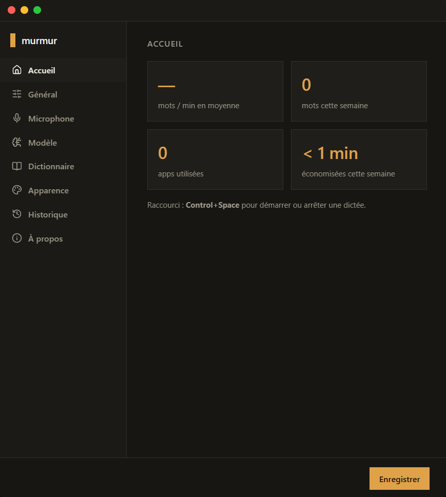
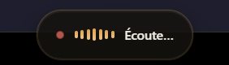

<div align="center">


# murmur

Dictée vocale privée, 100% locale, pour le français mêlé d'anglais.

[](../../releases/latest)
[](../../releases/latest)

<br />



</div>

<br />

J'en avais marre de taper au clavier pour tout, surtout quand un mot anglais se glisse au milieu d'une phrase en français et que le correcteur automatique s'en mêle. Alors j'ai fait murmur : un raccourci clavier, tu parles, le texte atterrit tout seul là où tu travailles. Whisper tourne sur ton propre GPU, rien ne sort de la machine.

## 🎙️ Ce qu'il y a dedans

Appuie sur `Ctrl+Espace`, une pastille apparaît en bas de l'écran et t'écoute. Réappuie, elle transcrit et colle le texte à l'endroit où était ton curseur.

<div align="center">

</div>

Elle reconnaît le français avec des mots anglais mêlés dedans sans les traduire (« il faut update le README avant la deadline »), et tu peux lui apprendre tes propres termes techniques ou noms propres dans le dictionnaire.

## 🏠 Un écran d'accueil qui compte pour toi

Vitesse moyenne, mots dictés cette semaine, apps utilisées, temps gagné par rapport à la frappe au clavier : tout ça se calcule tout seul, à partir de l'historique de tes dictées, stocké en local.

## ⚙️ Réglages

Clic droit sur l'icône de la barre système → **Réglages**. Tout est dans la barre latérale : raccourci clavier, choix du micro, choix du modèle Whisper, dictionnaire personnel, position et couleur de la pastille, historique des dictées.

## 📥 Installation

1. Télécharge `murmur Setup x.x.x.exe` sur la [page des versions](../../releases/latest).
2. Double-clique dessus. Le raccourci se crée tout seul sur le Bureau et dans le menu Démarrer.
3. C'est parti : l'icône apparaît dans la barre système, prête pour `Ctrl+Espace`.

> [!NOTE]
> La première fois, Windows va sûrement afficher une fenêtre bleue « Windows a protégé votre ordinateur ». Il fait ça avec toutes les petites apps qu'il ne connaît pas encore. Clique sur « Informations complémentaires », puis sur « Exécuter quand même ».

> [!WARNING]
> Il faut un GPU NVIDIA (CUDA). Sans ça, la transcription ne pourra pas tourner.

## 🔄 Les mises à jour

Quand je sors une nouvelle version, murmur la télécharge dans son coin et te propose de redémarrer pour l'installer. Si tu dis non, elle s'installera toute seule au prochain lancement.

## 🔒 Et tes données ?

Tout tourne en local : l'audio ne quitte jamais ta machine, la transcription se fait sur ton GPU via [whisper.cpp](https://github.com/ggml-org/whisper.cpp), et l'historique des dictées reste dans un fichier sur ton disque. Aucun serveur à moi entre les deux.

## 🛠️ Si ça coince

<details>
<summary><b>Le micro ne fonctionne pas</b></summary>
<br />
Vérifie dans Windows, Paramètres → Confidentialité et sécurité → Microphone, que l'accès micro est autorisé pour les applications de bureau.
</details>

<details>
<summary><b>Mon casque Bluetooth se déconnecte pendant la dictée</b></summary>
<br />
C'est Windows qui bascule le casque du profil audio (A2DP) vers le profil mains-libres (HFP) dès qu'une app demande le micro ; certains casques gèrent mal cette bascule. Choisis un autre micro dans Réglages → Microphone si besoin.
</details>

<details>
<summary><b>Ça ne fonctionne pas juste après le démarrage automatique de Windows</b></summary>
<br />
Le pilote GPU n'est pas toujours prêt immédiatement au boot. murmur retente plusieurs fois automatiquement (jusqu'à ~30 secondes) ; sinon, clic droit sur l'icône de la barre système → « Réessayer de démarrer le moteur ». Le journal est dans <code>%APPDATA%\murmur\logs\main.log</code>.
</details>

<details>
<summary><b>Rien ne se colle dans l'app active</b></summary>
<br />
Certaines applications lancées en administrateur refusent les entrées clavier simulées par un process non élevé. Évite de dicter dans ce cas, ou lance murmur en administrateur.
</details>

<details>
<summary><b>L'icône a disparu de la barre système</b></summary>
<br />
Elle se cache sûrement derrière la flèche <code>^</code> à côté de l'horloge. Fais-la glisser dans la barre des tâches pour la garder visible.
</details>

---

<details>
<summary>🛠️ <b>Pour bidouiller le code</b></summary>

<br />

Electron, electron-vite et TypeScript strict. Node 24+ et pnpm 10+.

### Prérequis

- GPU NVIDIA, CUDA Toolkit 12.8+
- CMake et Visual Studio 2022 Build Tools (workload « Desktop development with C++ »)
- git, ffmpeg accessibles dans le PATH

### Commandes

```bash
pnpm install
./scripts/setup-whisper.ps1              # clone + compile whisper.cpp avec CUDA
./scripts/download-model.ps1 -Model large-v3-turbo
pnpm dev                                  # mode développement
pnpm typecheck
pnpm lint
pnpm build:win                            # génère l'installeur dans dist/
```

Pour publier une version : monte `version` dans `package.json`, lance `pnpm build:win`, puis joins à une release GitHub les trois fichiers de `dist/` (l'installeur `.exe`, son `.blockmap` et `latest.yml`). S'il en manque un, la mise à jour automatique ne verra pas la nouvelle version.

| Dossier                  | Rôle                                                                 |
| ------------------------ | --------------------------------------------------------------------- |
| `src/main`                | tray, raccourci global, moteur whisper-server, historique, mises à jour |
| `src/preload`             | ponts entre l'app et chaque fenêtre                                   |
| `src/renderer/recorder`   | capture micro (fenêtre cachée)                                        |
| `src/renderer/overlay`    | la pastille flottante                                                 |
| `src/renderer/settings`   | la fenêtre Réglages                                                   |
| `src/shared`               | types et canaux IPC partagés                                          |
| `whisper-engine`           | whisper.cpp compilé + modèles (généré, pas versionné)                 |
| `scripts`                   | compilation de whisper.cpp, génération des icônes, téléchargement des modèles |

</details>

## 📄 Licence

[MIT](LICENSE)
